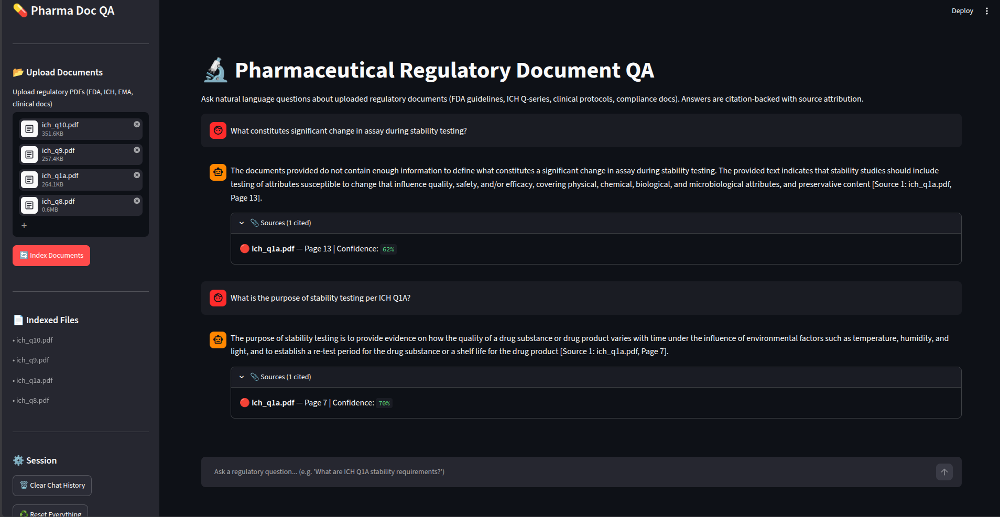

# pharma-regulatory-qa

RAG-powered QA system for pharmaceutical regulatory documents (ICH Q1A/Q8/Q9, FDA 21 CFR Part 11). Ask natural language questions → get citation-backed answers with source attribution and confidence scoring.

Built with LangChain, FAISS, Gemini 2.5 Flash, and Streamlit.

---

## Demo



> **Sample query:** "What are the long-term stability testing conditions per ICH Q1A?"
> **Answer:** Cites source document, page number, and confidence score.

---

## Architecture

```
PDFs (ICH/FDA)
    ↓
ingestion.py        PyMuPDF → chunk (800 tokens, 100 overlap) → embed → FAISS index
    ↓
retriever.py        cosine similarity search → top-k chunks → confidence threshold filter
    ↓
agent.py            context + query → Gemini 2.5 Flash → citation-backed answer
    ↓
streamlit_app.py    upload / query / session history / source attribution / confidence scoring
```

---

## Project Structure

```
pharma-regulatory-qa/
├── src/
│   ├── config.py           # model params, chunk size, paths
│   ├── ingestion.py        # PDF → chunk → embed → FAISS
│   ├── retriever.py        # semantic search, threshold filter
│   ├── agent.py            # direct RAG chain (Gemini)
│   └── validator.py        # eval: Token F1, ROUGE-L, Citation Hit Rate
├── app/
│   └── streamlit_app.py    # Streamlit UI
├── data/
│   ├── raw/                # regulatory PDFs (gitignored)
│   └── qa_pairs/
│       └── qa_pairs.json   # 10 ground-truth QA pairs
├── vector_store/           # persisted FAISS index (gitignored)
├── tests/
│   └── test_retriever.py   # unit tests (unittest + mocks)
├── notebooks/
│   └── exploration.ipynb   # chunking + retrieval experiments
├── generate_sample_data.py # synthetic PDFs + QA pairs for dev
├── requirements.txt
├── .env.example
└── .gitignore
```

---

## Stack

| Layer | Tool |
|---|---|
| PDF Parsing | PyMuPDF (`fitz`) |
| Chunking | LangChain `RecursiveCharacterTextSplitter` |
| Embeddings | OpenAI `text-embedding-3-small` |
| Vector DB | FAISS (persisted to disk) |
| LLM | Gemini 2.5 Flash (`langchain-google-genai`) |
| UI | Streamlit |
| Evaluation | Token F1, ROUGE-L, Citation Hit Rate |

---

## Setup

**1. Clone and install**
```bash
git clone https://github.com/peaceBot69/pharma-regulatory-qa
cd pharma-regulatory-qa
pip install -r requirements.txt
```

**2. Set API keys**
```bash
cp .env.example .env
# add OPENAI_API_KEY and GEMINI_API_KEY to .env
```

**3. Add regulatory PDFs**

Download from official sources and place in `data/raw/`:

| Document | Source |
|---|---|
| ICH Q1A — Stability Testing | [ich.org](https://www.ich.org/page/quality-guidelines) |
| ICH Q8 — Pharmaceutical Development | [ich.org](https://www.ich.org/page/quality-guidelines) |
| ICH Q9 — Quality Risk Management | [ich.org](https://www.ich.org/page/quality-guidelines) |
| FDA 21 CFR Part 11 | [fda.gov](https://www.fda.gov/media/75414/download) |

Or generate synthetic dev PDFs:
```bash
python generate_sample_data.py
```

**4. Index documents**
```bash
python src/ingestion.py --docs_dir data/raw --rebuild
```

**5. Launch app**
```bash
streamlit run app/streamlit_app.py
```

---

## Usage

- Upload PDFs via sidebar → click **Index Documents**
- Type regulatory questions in the chat box
- Answers include `[Source N: filename, Page X]` inline citations
- Confidence per source: 🟢 ≥85% | 🟡 ≥75% | 🔴 <75%

**Sample questions:**
```
What are the long-term stability testing conditions per ICH Q1A?
What is a Critical Quality Attribute (CQA)?
What does FDA 21 CFR Part 11 govern?
What is design space in pharmaceutical development?
What are the 3 questions risk assessment addresses per ICH Q9?
```

---

## Evaluation

Run validator against ground-truth QA pairs:
```bash
python src/validator.py --qa_file data/qa_pairs/qa_pairs.json --save_report
```

Metrics computed:
- **Exact Match** — normalised string equality
- **Token F1** — word-level precision/recall (SQuAD-style)
- **ROUGE-L** — longest common subsequence overlap
- **Citation Hit Rate** — expected source found in predicted citations

---

## Run Tests

```bash
python -m pytest tests/test_retriever.py -v
# or
python tests/test_retriever.py
```

---

## Configuration

Edit `src/config.py` to tune:

```python
CHUNK_SIZE = 800          # tokens per chunk
CHUNK_OVERLAP = 100       # overlap between chunks
TOP_K = 8                 # chunks retrieved per query
CONFIDENCE_THRESHOLD = 0.50  # minimum cosine similarity score
```

---

## Notes

- `vector_store/` and `data/raw/` are gitignored — rebuild index locally after cloning
- Gemini 2.5 Flash used for generation; OpenAI embeddings used for retrieval
- `AgentExecutor` dropped in favour of direct RAG chain for reliability with Gemini
